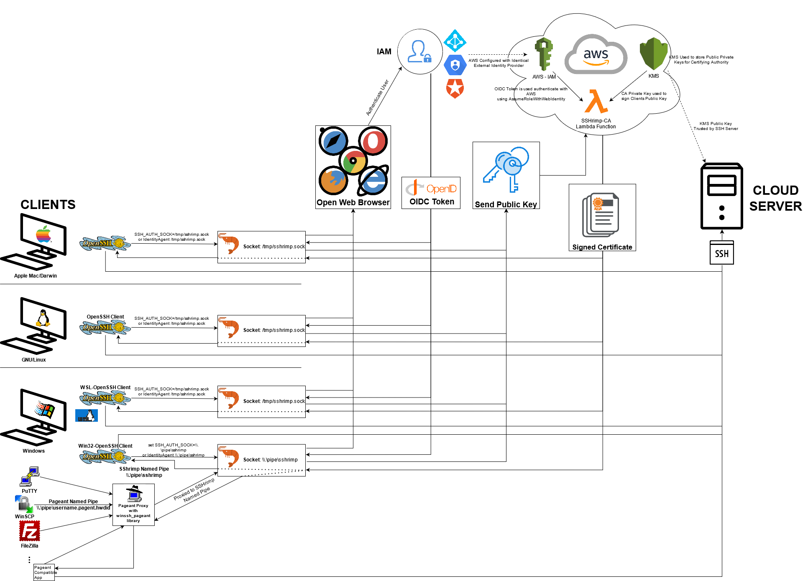

# sshrimp 🦐

SSH Certificate Authority in a lambda, automated by an OpenID Connect enabled agent.

Why? Check out this presentation [Zero Trust SSH - linux.conf.au 2020](http://youtu.be/lYzklWPTbsQ).

## How It Works


## ~~ Warning ~~

This is still in very early development. Only use for testing. Not suitable for use in production yet. PR's welcome ;)

## Quickstart

This project uses [mage](https://magefile.org/) as a build tool. Install it.

Build the agent, lambda, and generate terraform code ready for deployment:

    mage

## Deployment

[Terraform](https://www.terraform.io/) files are defined in `/terraform` and the generated `sshrimp-ca.tf.json` file can be used to automatically deploy sshrimp into multiple AWS regions.

    terraform init
    terraform apply

> You will need [AWS credentials](https://docs.aws.amazon.com/cli/latest/userguide/cli-chap-configure.html) in your environment to run `terraform apply`. You can also use [aws-vault](https://github.com/99designs/aws-vault) or [aws-oidc](https://github.com/stoggi/aws-oidc) to more securely manage AWS credentials on the command line.


To help with re-deploying each time changes are made, there's an additional ```rebuild.sh``` file which will destroy and re-create the terraform resources.

## sshd_config (on your server)

Server configruation is minimal. Get the public keys from KMS (using AWS credentials):

    mage ca:keys

Put these keys in a file on your server `/etc/ssh/trusted_user_ca_keys`, owned by `root` permissions `0644`.

Modify `/etc/ssh/sshd_config` to add the line:

    TrustedUserCAKeys /etc/ssh/trusted_user_ca_keys


## ssh_config (on your local computer)

Since OpenSSH (>= 7.3), you can use the [IdentityAgent](https://man.openbsd.org/ssh_config.5#IdentityAgent) option in your ssh config file to set the socketname you configured:

    Host *.sshrimp.io
        User jeremy
        IdentityAgent /tmp/sshrimp-agent.sock

This has the advantage of only using the agent for the group of hosts you need, and let other hosts use your regular agent (like github.com for cloning git repos). In fact, you can't add other identities to the sshrimp-agent. It's meant to be used for only the hosts you need it for.

> For other SSH clients or older versions, set the `SSH_AUTH_SOCK` environment variable when invoking ssh: `SSH_AUTH_SOCK=/tmp/sshrimp-agent.sock ssh user@host`

## Let's go!

Start the agent:

    sshrimp-agent /path/to/sshrimp.toml

SSH to your host:

    ssh example.server.sshrimp.io

🎉

## Why sshrimp?

* Shrimp have shells.
* Shrimp are lightweight.
* Has a [backronym](https://en.wikipedia.org/wiki/Backronym): SSH. Really. Isn't. My. Problem.
* Shrimp on a barbie?
* Yeah...


## Usage on Windows

On Windows, there are a number of applications that can be used as an SSH client, these are detailed in the following sections.
* Win32-OpenSSH Client
* PuTTY / WinSCP and related programs that use Pageant
* Windows Subsystem for Linux (WSL)


### Win32 - OpenSSH Client

On Windows you can use a built-in OpenSSH client (Win32-OpenSSH), this can either be downloaded and installed manually, built from source [here](https://github.com/PowerShell/Win32-OpenSSH/releases) or downloaded from the Optional Features settings (under Apps and Features on Windows 10) - Called OpenSSH Client.

**Once installed, this SSH client can simply be used by running SSH commands from a Windows CMD**

To use SSHrimp-Agent you cannot use UNIX Socket files (```/tmp/sshrimp.sock```), instead you must use Named Pipes - ```this is a Windows thing```. Named Pipes are written in the format ```\\.\pipe\pipename```
> So in SSHrimp-Agent, this could be written ```\\.\pipe\sshrimp```, however when defining the socket in the config file, YOU MUST ADD ADDITIONAL escape characters, ```i.e. Socket = "\\\\.\\pipe\\sshrimp"```

> Note that the default named pipe for OpenSSH Agent is \\.\pipe\openssh-ssh-agent, so if you use this with SSHrimp, then SSHrimp will be used as an SSH-Agent for all OpenSSH connections by default.

To use this newly defined named pipe when using SSH from a Windows CMD, you will also need to perform some additional tasks, you can either

1) Set the SSH_AUTH_SOCK environment variable,
```cmd
set SSH_AUTH_SOCK=\\.\pipe\ssh-pageant
ssh username@ipaddress
```

2) Or configure the IdentityAgent inside your ```~\.ssh\config``` file,
```bash
Host [NICKNAME]
    HostName [IP or HOSTNAME]
    User [USERNAME]
    IdentityAgent \\.\pipe\sshrimp
    ForwardAgent yes
```
> In this example I have also defined to forward the agent, this is useful if you are planning on using other libraries to read the users signed certificate, i.e. inheriting sudo privileges etc.

> To use the config file for SSH access, simply run the command ```ssh [NICKNAME]```


### PuTTY, WinSCP and Related programs
PuTTY, WinSCP and other related programs utilise the Putty Agent (Pageant).

Doing a lot of seraching, I found a repo by Nathan Beals which worked as a Pageant-style SSH-Agent proxy/emulator, find out more information [here](https://github.com/ndbeals/winssh-pageant).

When using SSHrimp-Agent for connecting a PuTTY, WinSCP or similar client, please ensure the config file references the socket as a named pipe, ```i.e. \\\\.\\pipe\\sshrimp``` and **NOT** as a UNIX socket, otherwise the Pageant emulator will not start when running SSHrimp-Agent.

It is also recommended that the actual Pageant application is never running at the same time SSHrimp-Agent is running, to avoid conflicts with Pageant connections.

### Windows Subsystem for Linux (WSL)

If using WSL, then you must use the SSHrimp-Agent like on a linux system, that means defining the config file with UNIX sockets ```i.e. Socket = /tmp/sshrimp.sock```

*Please note that to use an SSH Agent within WSL, you will need to use the SSH client in WSL as well (i.e. it won't work directly from Win32-OpenSSH or PuTTY)*

## Deployment Config File
Some of the fields that can be provided in config file are listed below,
```toml
[Agent] 
  ProviderURL = ""
  ClientID = ""
  ClientSecret = ""
  BrowserCommand = [""]
  Socket = ""

[CertificateAuthority]
  AccountID = XXXXX
  Regions = [""]
  FunctionName = "sshrimp"
  KeyAlias = "alias/sshrimp"
  ForceCommandRegex = "^$"
  SourceAddressRegex = ""
  UsernameRegex = "^(.*)@someemail\\.com"
  UsernameClaim = "email"
  ValidAfterOffset = "-5m"
  ValidBeforeOffset = "+2m"
  Extensions = ["permit-agent-forwarding", "permit-port-forwarding", "permit-pty", "permit-user-rc", "permit-x11-forwarding"]
  ProvisioningUser = "provisioninguser"
```
> Please note the Browser command is no longer being used, as instead the default browseris now always used.

## Provisioning User

An additional setting, this provided name will be added as an additional Principle name to the SSH certificate when signed.

*This is intended to be utilised when provisioning new users, through a future repository*

## Client Distribution

To build the SSHrimp-Agent for distribution across Windows, Linux and Mac, run the following mage command.

*Please note the BuildAndPackage command onlys builds on a Windows platform, specifically because building the Windows executable requires certain libraries only available on Windows, i.e winio*

    mage buildandpackage [config file]
> The ```[config file]``` is mandatory, and is used to generate the config file for each platform.

> This will build the sshrimp-agent for Windows, Mac and Linux and place these in the deploy folder.

The deploy folder is zipped into an archive, ```deploy.zip```, and contains the sshrimp-agent executable for each platform, as well as all the required config files and deploy scripts.

For distribution, the config file ONLY contains the bare minimum parameters, which are,
```toml
[Agent] 
  ProviderURL = ""
  ClientID = ""
  ClientSecret = ""
  BrowserCommand = [""]
  Socket = ""

[CertificateAuthority]
  AccountID = 11111111
  Regions = ["aaaaaaaa"]
```
## Code Sources
A thanks for help from
- Main body of this repository is forked from Jeremy Stott's SSHrimp project - https://github.com/stoggi/sshrimp - MIT
- Windows Pageant emulation/proxying - https://github.com/ndbeals/winssh-pageant -  BSD-3-Clause
- Usage with Pipes on Windows - https://github.com/benpye/wsl-ssh-pageant - BSD 2-Clause
- Minor updates to Serve Agent for allowing multiple connections - https://github.com/daveadams/vaulted/blob/56a9a631ececd4610d83d6499725b34d64285ccc/lib/proxy_keyring.go#L82 - MIT
- Create a launch agent on Mac - https://stackoverflow.com/questions/6442364/running-script-upon-login-mac


## TODO
* Investigate extending the principle names with an additional name for the users email (this will make it easier when provisioning the user for the first time)